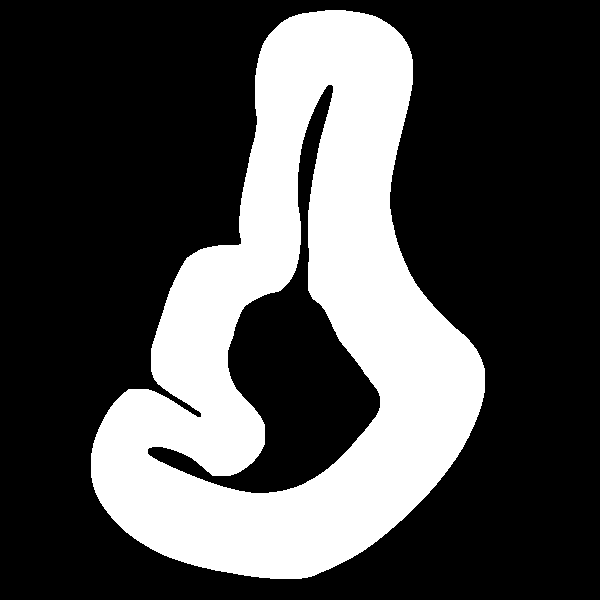
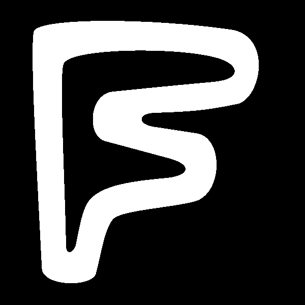
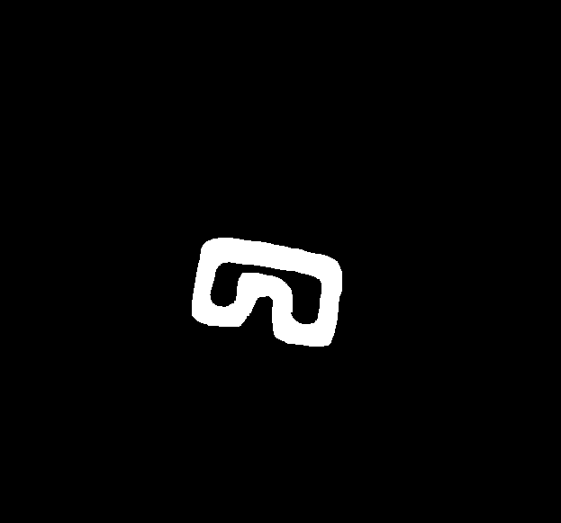
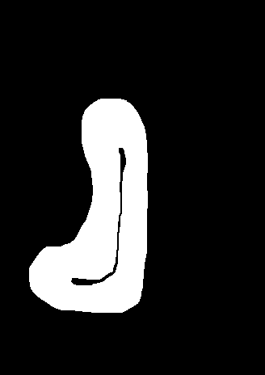
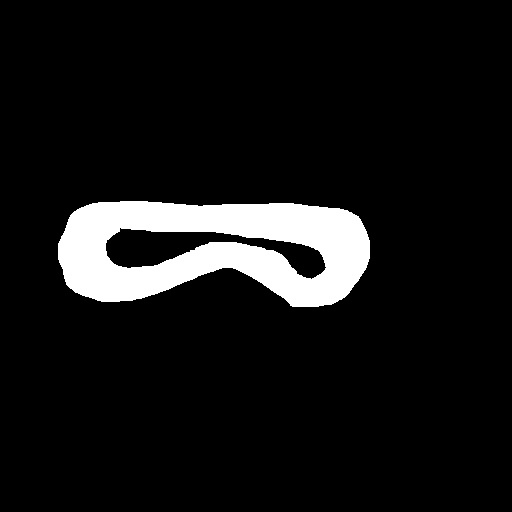

# F1TENTH ML Controller — MAP Extension

This project extends the MAP (Model- and Acceleration-based Pursuit) controller with ML-based steering controllers for the F1TENTH 1:10 scale autonomous racing platform.

Instead of predicting steering from raw pose, the ML models use physics-based features — cross-track error, heading error, curvature, velocity, and lookahead curvature — making them map-agnostic. This allows a single trained model to generalize to tracks it has never seen before.

Three controller types are available alongside the original:
- **MAP Controller** — physics-based baseline using L1 guidance and a steering lookup table
- **ML Controller** — deep neural network (PyTorch MLP) trained on data from multiple maps
- **ML Controller 2** — classical ML models (XGBoost, Random Forest, SVM, Gaussian Process)

Data was collected from real car runs on 5 maps at 2 speed profiles (0.6 and 0.825 velocity scale). Models were trained on 4 maps and tested on porto to evaluate generalization to unseen tracks. Controller performance was compared statistically using the Wilcoxon signed-rank test on lateral error distributions.

## Maps

| berlin | f | hangar |
|:---:|:---:|:---:|
|  |  |  |

| overtake_map | porto |
|:---:|:---:|
|  |  |

Porto was used exclusively as the test map — no porto data was used during training.

## Controllers

| Launch file | Controller |
|---|---|
| `sim_MAP.launch` | MAP Controller (physics-based baseline) |
| `sim_ML_controller.launch` | Neural Network (PyTorch MLP) |
| `sim_ML_2_controller.launch` | Classical ML (XGBoost / RF / SVM / GP) |
| `sim_PP.launch` | Pure Pursuit (geometric baseline) |

For full project documentation see `src/Data/info.txt`.

---

## Getting Started

### Prerequisits

Before getting started with this project, make sure you have the following software installed:

* ROS Noetic
* Catkin tools: `sudo apt install python3-catkin-tools`

You can find instructions on how to install ROS for your operating system on the official ROS wiki page: http://wiki.ros.org/ROS/Installation

### Dependencies

* tf2_geometry_msgs
* ackermann_msgs
* joy
* map_server
* scipy

You can install them by running:
```
sudo apt-get install ros-noetic-tf2-geometry-msgs ros-noetic-ackermann-msgs ros-noetic-joy ros-noetic-map-server python3-scipy
```

### Installing

To install this package, first, create a new ROS workspace and navigate to the src folder:

```
mkdir -p ~/catkin_ws/src
cd ~/catkin_ws/src
```

Then, clone the repository into the src folder:

```
git clone https://github.com/Sanjeev-gour/HU_Research.git
```

Once the repository has been cloned, build the package:
```
cd ~/catkin_ws
source /opt/ros/noetic/setup.bash
catkin build
```

### Running the Package
After building the package, source the setup.bash file to add the package to your ROS environment:

```
source ~/catkin_ws/devel/setup.bash
```

You can now run the MAP controller using the roslaunch command:
```
roslaunch map_controller sim_MAP.launch
```

You can change the map by specifying `map_name:=desired_map` where desired_map is one of: `berlin | f | hangar | overtake_map | porto`

Run the neural network ML controller:
```
roslaunch map_controller sim_ML_controller.launch
```

Run the classical ML controller:
```
roslaunch map_controller sim_ML_2_controller.launch
```

Alternatively, you can run the Pure Pursuit controller for comparison:
```
roslaunch map_controller sim_PP.launch
```

## Reference

This work builds on the MAP controller published at ICRA 2023. See the [pre-print](https://arxiv.org/pdf/2209.04346.pdf).

```
@inproceedings{Becker_2023,
	doi = {10.1109/icra48891.2023.10161472},
	url = {https://doi.org/10.1109%2Ficra48891.2023.10161472},
	year = 2023,
	month = {may},
	publisher = {{IEEE}},
	author = {Jonathan Becker and Nadine Imholz and Luca Schwarzenbach and Edoardo Ghignone and Nicolas Baumann and Michele Magno},
	title = {Model- and Acceleration-based Pursuit Controller for High-Performance Autonomous Racing},
	booktitle = {2023 {IEEE} International Conference on Robotics and Automation ({ICRA})}
}
```
